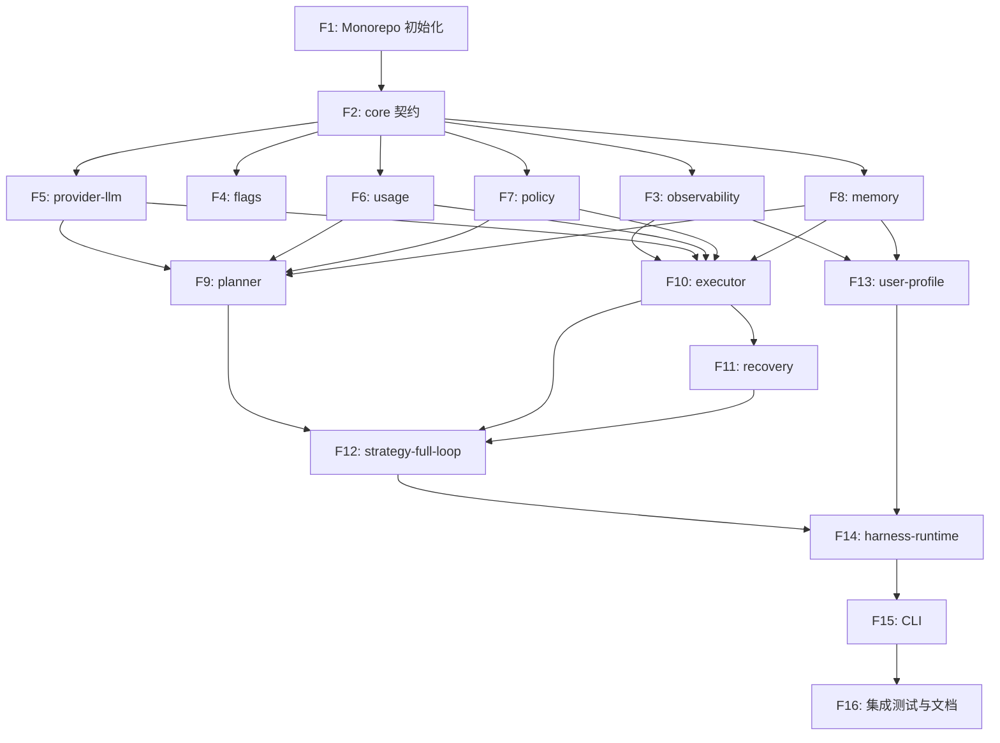

# AI Agent Harness MVP 实施计划

本计划将 MVP 拆解为 **16 个独立 Feature**，每个 Feature 可独立开发、测试、合并。Feature 间依赖关系明确，按顺序实施即可逐步构建完整闭环。每个 Feature 包含：目标、涉及包、具体任务、验收标准、依赖。

> **状态（2026-09-06，计划 v3）**：以下“已完成”项均已实现并提交；当前质量门禁为 `pnpm check`（34 个测试文件 / 173 个测试）。本文件下部的 F1–F16 单任务 checkbox 是历史 MVP 原始拆解，不再逐项维护。

---

## 当前计划与完成状态（v3）

### 已完成

| 范围 | 状态 | 验证 |
| --- | --- | --- |
| F1–F16（MVP 执行链路） | ✅ 已完成 | `packages/*`、`apps/cli` 测试全绿 |
| 总体设计 v1.3 / 会话结构定义 | ✅ 已完成 | `docs/总体设计文档v1.3.md`、`docs/会话与Session结构定义.md` |
| core Session 去 userId，用户归属上移 Conversation | ✅ 已完成 | core/memory 测试 |
| Conversation API 抽象与持久化（`conversations.json`） | ✅ 已完成 | `/api/conversations` 测试 |
| Conversation 追加 Session（续聊） | ✅ 已完成 | API + WebUI 测试 |
| Conversation 管理：重命名/归档/恢复/删除 | ✅ 已完成 | API + WebUI 测试 |
| 项目重命名 | ✅ 已完成 | API 测试 |
| 移除旧 `workspaces.json` sessionIds 兼容层 | ✅ 已完成 | 自动回填 + 清理测试 |
| WebUI Conversation 列表/工作区/归档/多 Session 导航/空状态 | ✅ 已完成 | Vite build + WebUI 相关测试 |
| `/api/conversations` 分页与标题筛选 | ✅ 已完成 | API 测试 |
| failure_ledger 最小闭环 | ✅ 已完成 | SQLite/API/WebUI 测试 |
| Provider 轮次归一（`LLMRound` + `collectLLMRound`） | ✅ 已完成 | provider-llm/executor 测试 |
| Observer：工具结果 + LLM 文本/思考的结构化裁剪 | ✅ 已完成 | observability/executor 测试 |
| MechanicalReflector（独立机械验收） | ✅ 已完成 | strategy-full-loop 测试 |
| Full-Loop 启用 `needsObserve/needsReflect` | ✅ 已完成 | strategy 测试 |

### 已修复（2026-09-06）

| 问题 | 根因 | 修复 | 验证 |
| --- | --- | --- | --- |
| 真实厂商会话全部失败（单轮/多轮均无法完成） | `providers.json`/CLI 预设仍使用已退役模型 `deepseek-chat`，pi-ai 目录不再包含该模型，`PiAiDriver.resolveModel()` 抛 `未找到模型` | DeepSeek 预设与运行配置改用 pi-ai v4 目录模型：`deepseek-v4-flash`（默认）/ `deepseek-v4-flash-vision-exp` / `deepseek-v4-pro` | 回归测试断言目录内可解析 + 真实单轮/多轮对话跑通 |

### 下一步计划

#### 1. LLM-as-verifier（执行中验证，优先于 judge）

目标：在模型产生候选输出/工具调用后、进入下一步动作前，由独立的 LLM 验证器给出 `accepted/rejected + reason`，直接参与重试或回滚决策。

实施要点：

- [ ] core：在现有 `Reflector` 契约基础上新增/扩展 verifier 请求与结论类型；
- [ ] provider：支持为 verifier 单独选择模型与调用方式（只读、无副作用）；
- [ ] Full-Loop/Executor：接入“候选输出 → verifier → 决策”调用点；
- [ ] 事件：复用 `reflection.verdict`，验证过程可审计；
- [ ] 验收：错误候选能被拦截，且拒绝原因回传决策层；全量测试。

#### 2. LLM-as-judge（事后评估，排在 verifier 之后）

目标：任务/Session 完成后对结果质量做独立评估，服务用户反馈、画像、A/B 与 Harness 自我改进。

实施要点：

- [ ] judge 调用与执行链路解耦，不阻塞运行；
- [ ] 评估结果写入记录/账本，便于事后复盘；
- [ ] 引入人工标注校准集与 Platt/isotonic 校准，再逐步上线；
- [ ] 先数据积累，再升级 M4 反馈回路。

### 暂不实施 / 后续 backlog

- 存储 SPI / PostgreSQL / migrations 重构：本期不做，仅保留 `MemoryStore` 抽象 + SQLite 本地实现；
- M2 审批门与沙箱、M3 记忆、M5–M8（六因子、A/B 平台、策略生态、画像深化）：
  继续排在 verifier/judge 之后，按 v1.3 路线推进。

---

### 历史 MVP F1–F16 记录

以下内容为已完成的历史实施记录，保留供追溯，不作为当前待办清单。

---

## 实施顺序与依赖关系

说明：实线为强依赖，部分基础包可并行开发（如 F3~F8 在 F2 完成后可并行）。

---

## Feature 详情

### F1: Monorepo 初始化与基础配置

**目标**：搭建 pnpm workspace + TypeScript 项目结构，配置构建、lint、test 基础。

**涉及包**：全部包目录（空壳）

**任务**：

- [ ] 初始化 `pnpm-workspace.yaml`，定义 `packages/*` 和 `apps/*` 为工作区。
- [ ] 创建 `tsconfig.base.json`，启用严格模式、路径别名（`@mazi/*`）。
- [ ] 配置 `turbo.json` 用于并行构建。
- [ ] 创建各包目录及最小 `package.json`（名称、版本、入口、脚本）。
- [ ] 添加 ESLint + Prettier 配置。

**验收标准**：

- [ ] `pnpm install` 成功。
- [ ] 所有包可被正确解析（`pnpm -r build` 无错误，即使无源码）。
- [ ] 目录结构与设计文档一致。

**依赖**：无

---

### F2: core 契约定义

**目标**：实现 `packages/core` 中全部类型契约，确保零运行时依赖。

**涉及包**：`packages/core`

**任务**：

- [ ] 创建 `src/` 下所有契约文件（参照设计文档 §3）：
  - `session.ts`：Session, Turn, Step, SessionAggregate, TurnCheckpoint
  - `goal.ts`：GoalContract, GlobalBudget, Constraint, StrategyHint
  - `turn-contract.ts`：TurnContract, TaskTag, ToolRequirement, FailureSignal, BudgetSlice, SideEffectSpec
  - `capacity.ts`：Capacity, ToolSpec, PermissionLevel
  - `provider.ts`：Provider, ModelDescriptor, SpecialtyTag, PerformanceProfile, PricingSchedule, EconomicsProfile, TagEconomics
  - `usage.ts`：VendorUsage, RuntimeContextBreakdown, CostBreakdown, UsageTiming, Usage
  - `planner.ts`：Planner 接口（简易）
  - `strategy.ts`：HarnessStrategy, StrategyCapabilities, StrategyContext, PlanEstimate
  - `observability.ts`：TraceIdentifiers, HarnessEvent, HarnessEventType, EventBus, EventFilter
  - `flags.ts`：FeatureFlagDefinition, FlagRule, FlagSnapshot
  - `user-interaction.ts`：UserInteractionRecord, ThoughtSummary, ActionSummary, UserFeedback
  - `memory.ts`, `policy.ts`（简化接口）
  - `index.ts` 导出所有类型。
- [ ] 确保 `dependencies` 为空，所有类型使用 `type` / `interface`。
- [ ] 编写基础类型测试（可选）。

**验收标准**：

- [ ] `packages/core` 可独立编译通过。
- [ ] `pnpm -r exec tsc --noEmit` 无错误。
- [ ] 契约类型完整，字段与设计文档一致。

**依赖**：F1

---

### F3: observability - EventBus 与 JSONL 持久化

**目标**：实现事件总线，支持 emit/subscribe/replay，所有事件强制写入 JSONL 文件。

**涉及包**：`packages/observability`

**任务**：

- [ ] 实现 `EventBus` 类：
  - `emit(event)`：同步推送至订阅者，异步写文件。
  - `subscribe(filter, sink)`：支持按事件类型过滤。
  - `replay(sessionId)`：读取 JSONL 文件，过滤该 session 事件。
- [ ] 实现 JSONL 文件写入器（路径来自环境变量 `EVENT_LOG_DIR`，默认 `./events`）。
- [ ] 文件按 `sessionId` 分文件（`<sessionId>.jsonl`），每条一行。
- [ ] 确保写入操作不阻塞主流程（异步 queue）。
- [ ] 基础日志轮转（可选，按文件大小）。

**验收标准**：

- [ ] 事件可 emit 且写入文件。
- [ ] 订阅者能收到符合 filter 的事件。
- [ ] 关闭 `console.sink` 不影响文件落盘。
- [ ] 重启后 `replay(sessionId)` 能恢复全部事件。

**依赖**：F2

---

### F4: flags - FeatureFlag 求值

**目标**：实现 Flag 定义求值与快照冻结。

**涉及包**：`packages/flags`

**任务**：

- [ ] 实现 `FeatureFlagDefinition` 加载（从 JSON 或代码定义）。
- [ ] 实现 `evaluate(flagKey, context)`：按规则顺序匹配（userId、goalTag、bucketRange 等）。
- [ ] 实现 `FlagSnapshot`：对 Session 求值一次，冻结结果，提供 `isEnabled/getNumber/getString`。
- [ ] 实现 A/B 分桶哈希（sessionId → 0-99）。
- [ ] 内置默认 Flag 集（见 MVP 文档 §3.9 或设计文档 §8）。

**验收标准**：

- [ ] 规则匹配正确，优先级生效。
- [ ] Session 内 Flag 值不变。
- [ ] 未匹配规则时使用默认值。

**依赖**：F2

---

### F5: provider-llm - Driver 适配与简单路由

**目标**：对接 pi-ai，实现模型调用、Provider 池、简单路由。

**涉及包**：`packages/provider-llm`

**任务**：

- [ ] 实现 `LLMDriver` 接口（基于 pi-ai）。
- [ ] 实现 `ProviderPool`：加载 Provider 配置（JSON），管理健康状态。
- [ ] 实现 `SimpleRouter`：
  - 输入：TurnContract.tags + Provider 列表。
  - 过滤：能力匹配（supportsTools 等）且 health.score > 0.5。
  - 排序：按基础价格（input+output 简单组合）升序。
  - 输出：选中的 Provider/Model。
- [ ] 实现调用封装：`generateText` / `streamText`（MVP 使用非流式）。
- [ ] 捕获厂商 usage（若 pi-ai 提供），否则标记 `reportedByVendor=false`。
- [ ] 失败时触发 fallback，尝试下一 Provider，emit `provider.fallback`。

**验收标准**：

- [ ] 可成功调用配置的任一 Provider 并返回文本。
- [ ] 路由结果记录在 `provider.selected` 事件。
- [ ] 首选 Provider 失败时自动切换。

**依赖**：F2, F3（事件发布）

---

### F6: usage - Usage 双层采集与成本计算

**目标**：实现 Runtime context 计数、成本计算、聚合器。

**涉及包**：`packages/usage`

**任务**：

- [ ] 实现 `TokenizerRegistry`（估算 tokenizer：字符数/4）。
- [ ] 实现 `ContextMeter`：输入 context 分段（systemPrompt, history, tools, newInput, observation 等）计数，生成 `RuntimeContextBreakdown`。
- [ ] 实现 `CostCalculator`：基于 Provider 的 `pricing.base` 和 VendorUsage 计算成本。
- [ ] 实现 `Aggregator`：订阅事件，将 Usage 挂到 Step，累计 Turn/Session 级聚合。
- [ ] 回填 `estimationDriftTokens`。

**验收标准**：

- [ ] 每个 LLM Step 均可获得完整 `Usage`。
- [ ] Turn 结束时正确累计 Usage。
- [ ] `RuntimeContextBreakdown` 包含所需字段。

**依赖**：F2, F3, F5

---

### F7: policy - 基础 Policy Engine

**目标**：实现工具白名单、权限、参数校验、预算检查。

**涉及包**：`packages/policy`

**任务**：

- [ ] 实现 `PolicyEngine`：
  - `checkToolCall(capacity, toolName, args, estimatedCost) → { pass, reason }`
  - 校验项：工具在白名单、权限满足、参数 schema（TypeBox）、预算不超限。
- [ ] 与 Executor 集成点：在工具调用前调用。
- [ ] 失败时 emit `policy.denied` / `tool.blocked`。
- [ ] MVP 不实现审批门，若工具 `irreversible=true` 直接拒绝（或按 Flag 处理）。

**验收标准**：

- [ ] 构造越权调用被拦截。
- [ ] 参数不合规被拦截。
- [ ] 预算检查生效。

**依赖**：F2, F3

---

### F8: memory - SQLite 持久化

**目标**：实现 Session/Turn/Step/UserInteraction 的持久化存储。

**涉及包**：`packages/memory`

**任务**：

- [ ] 使用 `better-sqlite3` 或 `sqlite3` 创建数据库。
- [ ] 定义表结构（sessions, turns, steps, user_interactions）。
- [ ] 实现 CRUD：保存/加载 Session、Turn、Step。
- [ ] 实现 Checkpoint 字段的读写（Turn 表）。
- [ ] 提供 `MemoryStore` 接口供上层使用。

**验收标准**：

- [ ] Session 及其关联 Turn/Step 可完整持久化和恢复。
- [ ] 查询性能满足 MVP（简单索引）。

**依赖**：F2

---

### F9: planner - 简化 Planner

**目标**：单 Turn 生成、派生校验、Capacity 组装。

**涉及包**：`packages/planner`

**任务**：

- [ ] 实现 `Planner` 类：
  - `plan(goal)`：生成单个 TurnContract（简单复制 statement，tags 默认 'general'）。
  - 执行三条派生校验（工具、权限、预算），失败 emit `plan.invalid`。
  - 均分预算：全部可分配预算给单 Turn。
- [ ] 实现 `assembleCapacity(turn)`：
  - 调用 SimpleRouter 选择 Provider。
  - 解析 requiredTools 为 ToolSpec[]（从工具注册表读取）。
  - 计算 permission = min(contract.maxPermission, max(tool.minPermission))。
  - 生成 Capacity。
- [ ] emit `plan.created`, `capacity.assembled`。

**验收标准**：

- [ ] 校验失败时拒绝出计划。
- [ ] Capacity 中包含模型、工具、权限、预算。

**依赖**：F2, F3, F5, F6, F7, F8

---

### F10: executor - Step 执行器

**目标**：循环执行 Step，集成 Policy、Usage、工具调用。

**涉及包**：`packages/executor`

**任务**：

- [ ] 实现 `Executor` 类：
  - `executeTurn(turn, capacity)`：循环调用 LLM，处理响应。
  - 识别 thinking/tool_call/observation 三种 Step。
  - 采集点 A：调用 `ContextMeter` 构建 RuntimeContextBreakdown。
  - LLM 请求：通过 provider-llm 调用，捕获 VendorUsage（采集点 B）。
  - 采集点 C：计算成本，挂载 Usage。
  - 工具调用前：调用 PolicyEngine 校验。
  - 执行工具：调用工具实现（从注册表获取）。
  - 工具结果回注到 context，继续循环。
  - 每个 Step 结束后更新 TurnCheckpoint（通过 recovery 接口）。
  - 检测终止条件（maxSteps、超时、成功）。
- [ ] 实现简单的工具注册表（可加载 JSON 配置，如 fs.read）。

**验收标准**：

- [ ] 能完成一个包含工具调用的简单任务。
- [ ] 每个 Step 均有完整 Usage。
- [ ] Policy 拦截生效。
- [ ] Checkpoint 已写入。

**依赖**：F3, F5, F6, F7, F8, F11（recovery 可先提供接口桩）

---

### F11: recovery - Checkpoint 与恢复

**目标**：保存和加载 Turn 级 Checkpoint，支持断点续传。

**涉及包**：`packages/recovery`

**任务**：

- [ ] 定义 `CheckpointManager`：
  - `saveCheckpoint(turn)`：持久化到 Turn 表。
  - `loadCheckpoint(turnId)`：返回 TurnCheckpoint。
  - `resumeTurn(turn)`：根据 checkpoint 恢复，跳过已完成 Step。
- [ ] 与 Executor 集成：每个 Step 完成后保存。
- [ ] 进程重启后，通过 `loadCheckpoint` 恢复执行。

**验收标准**：

- [ ] 模拟中断后，从最近 checkpoint 恢复，不重复执行已完成 Step。

**依赖**：F2, F8, F10（集成时使用）

---

### F12: strategy-full-loop - 简化 Full-Loop 策略

**目标**：实现完整的 Goal→Plan→Execute→简单 Reflect 流程。

**涉及包**：`packages/strategy-full-loop`

**任务**：

- [ ] 实现 `FullLoopStrategy`，满足 `HarnessStrategy` 接口。
- [ ] 编排：
  - 调用 Planner.plan 生成 TurnContract。
  - 对每个 Turn：assembleCapacity → executor.executeTurn。
  - 简单 Reflect：检查 Turn 状态，失败按 failureSignals 处理（MVP 仅支持 retry 和 abort）。
- [ ] 多 Turn 支持（虽然 MVP 可能只生成 1 个 Turn，但代码支持循环）。
- [ ] emit `strategy.selected`。

**验收标准**：

- [ ] 能驱动完整任务执行并返回结果。
- [ ] 失败时能按配置重试或中止。

**依赖**：F9, F10, F11

---

### F13: user-profile - 用户交互记录

**目标**：实现 UserInteractionRecord 的创建、更新与持久化。

**涉及包**：`packages/user-profile`

**任务**：

- [ ] 实现 `UserProfileRecorder`：
  - 订阅事件总线。
  - `session.started` 事件触发创建记录（保存 rawInput、userId、inputTimestamp，状态 recording）。
  - `step.ended` 提取 thoughtTrace/actionTrace 追加。
  - `user.feedback.captured` 追加反馈。
  - `session.ended` 填充 outcome、metrics，状态置 completed。
- [ ] 存储到 memory 包的用户交互表。
- [ ] 提供查询接口（按 userId 或 sessionId）。

**验收标准**：

- [ ] Session 结束后，存在完整记录。
- [ ] 记录包含原始输入和反馈（如果有）。
- [ ] 记录写入不影响主流程。

**依赖**：F3, F8, F2

---

### F14: harness-runtime - 装配器

**目标**：将策略、Planner、Executor、事件总线等模块装配为可运行实例。

**涉及包**：`packages/harness-runtime`

**任务**：

- [ ] 实现 `HarnessRuntime` 类：
  - 构造函数接受配置（Provider 列表、工具列表、Flag 定义）。
  - 创建 EventBus、FlagSnapshot、MemoryStore、ProviderPool、PolicyEngine 等。
  - 提供 `run(input: string, userId?: string)`：创建 Session，启动 FullLoopStrategy，返回结果。
- [ ] 在 Session 创建时求值 Flag 并冻结。
- [ ] 启动 UserProfileRecorder。
- [ ] 处理 Session 结束。

**验收标准**：

- [ ] 外部只需调用 `runtime.run("任务")` 即可获得结果。
- [ ] 模块间 wiring 正确。

**依赖**：F3, F4, F5, F6, F7, F8, F9, F10, F11, F12, F13

---

### F15: CLI 应用

**目标**：提供命令行入口，读取用户输入，输出结果。

**涉及包**：`apps/cli`

**任务**：

- [ ] 使用 `commander` 或手动解析参数。
- [ ] 支持 `harness run "任务描述"` 单命令模式。
- [ ] 支持交互模式（可选）：输入后执行，执行中可输入反馈。
- [ ] 加载配置文件（providers.json, tools.json, flags.json）。
- [ ] 输出执行日志和最终结果。

**验收标准**：

- [ ] 通过 CLI 能完成一次简单任务。
- [ ] 用户反馈可被捕获（如输入“满意/不满意”）。

**依赖**：F14

---

### F16: 端到端集成测试与文档

**目标**：验证完整流程，编写基础文档和示例。

**任务**：

- [ ] 编写集成测试：模拟用户输入 → 执行 → 检查结果、事件、Usage、用户记录。
- [ ] 编写 README，说明如何运行、配置。
- [ ] 提供一个示例任务（如“读取 README.md 并总结前 100 字”）。
- [ ] 确保所有验收标准通过。

**验收标准**：

- [ ] 端到端测试通过。
- [ ] 文档清晰。

**依赖**：F15

---

## 建议实施节奏

- **第 1 周**：完成 F1-F4（基础包），可并行。
- **第 2 周**：完成 F5-F8（能力包），依赖 F2 已就绪。
- **第 3 周**：完成 F9-F11（执行核心），开始集成。
- **第 4 周**：完成 F12-F16（策略、用户记录、装配、CLI、测试），交付可运行 MVP。

---

以上实施计划可直接用于分配开发任务，每个 Feature 均可独立交付与验证。
